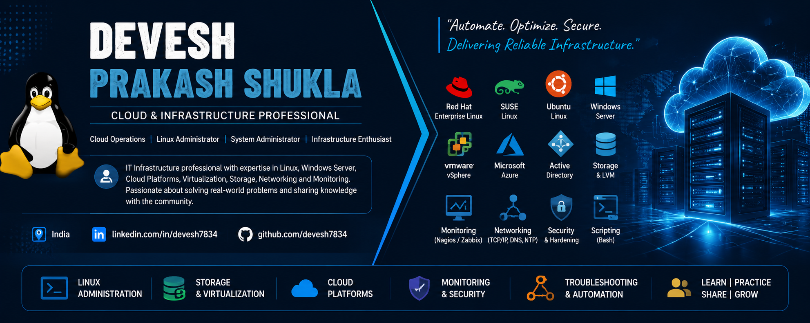

  

About Me :-

### 🧑‍💻 RHCSA Certified | Cloud Admin | Linux Admin | Windows Admin |  IT Infrastructure |

## 🏆 Certifications

### 🔴 Red Hat Certified System Administrator (RHCSA)

📜 [View RHCSA Certificate](./RHCSA%20Certificate%20-%20Devesh%20Shukla.pdf)

### 🔵 Microsoft Certified: Azure Administrator Associate (AZ-104)

📜 [View AZ-104 Certificate](./AZ-104%20Certificate.pdf)

### 🟠 AWS Cloud Operations

📜 [View AWS Cloud Operations Certificate](./Devesh%20Prakash%20Shukla%20AWS%20Cloud%20Ops%20Certificate.pdf)

I am an RHCSA-certified IT Infrastructure and Cloud Operations professional with 8 years of experience in Data Center Management, Cloud Administration, Windows & Linux Server Administration, Virtualization, and Infrastructure Operations.

Currently working as an Assistant Manager – Cloud Operations at Yotta Data Center, I work across enterprise infrastructure environments with a focus on server administration, virtualization, cloud operations, monitoring, security, troubleshooting, and high availability. I am passionate about infrastructure reliability, automation, continuous learning, and sharing practical IT knowledge to help professionals and aspiring system administrators grow their technical skills.

Welcome to my GitHub Profile!

🎓 Education Qualification :-

MCA – Master of Computer Application from IGNOU New Delhi.

PGDCA – Post Graduate Diploma in Computer Application from IGNOU New Delhi.

B.Sc. (PCM) – Batchelor of Science from APS University. 

Intermediate - from U.P Board Prayagraj Uttar Pradesh.

High School - from U.P Board Prayagraj Uttar Pradesh.

💼 Professional Experience

🏢 Yotta Data Center, Noida  ·  Assistant Manager - Cloud Operations   Oct 2025 – Present

  Manage and support enterprise cloud and data center infrastructure with a focus on availability, performance, security, and operational reliability.
• Provision, configure, maintain, patch, and troubleshoot Windows Server environments.
• Administer Linux environments including RHEL, CentOS, and Ubuntu across production infrastructure.
• Manage Active Directory, AD DS, users, groups, Organizational Units (OUs), and Group Policy Objects (GPOs).
• Configure and troubleshoot DNS, DHCP, IIS, SSL certificates, file services, and other enterprise infrastructure services.
• Administer VMware environments including VM provisioning, cloning, snapshots, datastores, virtual networking, HA, DRS, FT, and vMotion.
• Manage Linux storage and file systems including partitions, LVM, NFS, Samba, FTP, SSH, and secure access controls.
• Monitor CPU, memory, storage, network, system logs, and infrastructure health to identify and resolve performance and availability issues.
• Perform server hardening, security configuration, patching, vulnerability remediation, and incident troubleshooting.
• Troubleshoot hardware, operating system, application, network, domain, and authentication-related issues.
• Work on infrastructure monitoring using tools such as Nagios and Zabbix to support proactive issue detection and high availability.
• Provide L2/L3 technical support and coordinate infrastructure activities through incident, change, and operational processes.

🏢 RailTel Corporations of India Limited (Under - Ministry of Railway Govt of India)  (Payroll - Orbit Techsol)  ·  Cloud Admin   Mar 2024 – Oct 2025

  Managed and optimized Windows and Linux-based data center infrastructure.
 • Provided day-to-day administration, monitoring, troubleshooting, and operational support for cloud and virtual infrastructure.
 • Worked across VMware, Hyper-V, Microsoft Azure, AWS, and Red Hat Open Stack Cloud Administrations.
 • Supported high availability, security, performance, and reliability of enterprise infrastructure.
 • Managed Windows Server infrastructure and services including Active Directory Domain Services (AD DS), DNS, DHCP, and WSUS.
 • Administered Linux environments and supported server-level troubleshooting and operational activities.
 • Managed and supported VMware virtualization infrastructure and virtual machines.
 • Supported Microsoft Azure, Office 365, and Microsoft Entra ID administration and related infrastructure operations.
 • Performed infrastructure monitoring using Nagios, Zabbix, and Grafana to proactively identify and troubleshoot issues.
 • Supported network and data center operations, coordinating with cross-functional teams for incident resolution and infrastructure activities.
 • Assisted with infrastructure security, patching, troubleshooting, and operational activities to maintain service availability.
 • Collaborated with cross-functional teams to improve operational processes and maintain secure, scalable, and reliable infrastructure.

🏢 Yotta Data Center, Noida  ·  Assistant Manager - Cloud Operations   Oct 2025 – Present

  Manage and support enterprise cloud and data center infrastructure with a focus on availability, performance, security, and operational reliability.
• Provision, configure, maintain, patch, and troubleshoot Windows Server environments.
• Administer Linux environments including RHEL, CentOS, and Ubuntu across production infrastructure.
• Manage Active Directory, AD DS, users, groups, Organizational Units (OUs), and Group Policy Objects (GPOs).
• Configure and troubleshoot DNS, DHCP, IIS, SSL certificates, file services, and other enterprise infrastructure services.
• Administer VMware environments including VM provisioning, cloning, snapshots, datastores, virtual networking, HA, DRS, FT, and vMotion.
• Manage Linux storage and file systems including partitions, LVM, NFS, Samba, FTP, SSH, and secure access controls.
• Monitor CPU, memory, storage, network, system logs, and infrastructure health to identify and resolve performance and availability issues.
• Perform server hardening, security configuration, patching, vulnerability remediation, and incident troubleshooting.
• Troubleshoot hardware, operating system, application, network, domain, and authentication-related issues.
• Work on infrastructure monitoring using tools such as Nagios and Zabbix to support proactive issue detection and high availability.
• Provide L2/L3 technical support and coordinate infrastructure activities through incident, change, and operational processes.

🏢 Yotta Data Center, Noida  ·  Assistant Manager - Cloud Operations   Oct 2025 – Present

  Manage and support enterprise cloud and data center infrastructure with a focus on availability, performance, security, and operational reliability.
• Provision, configure, maintain, patch, and troubleshoot Windows Server environments.
• Administer Linux environments including RHEL, CentOS, and Ubuntu across production infrastructure.
• Manage Active Directory, AD DS, users, groups, Organizational Units (OUs), and Group Policy Objects (GPOs).
• Configure and troubleshoot DNS, DHCP, IIS, SSL certificates, file services, and other enterprise infrastructure services.
• Administer VMware environments including VM provisioning, cloning, snapshots, datastores, virtual networking, HA, DRS, FT, and vMotion.
• Manage Linux storage and file systems including partitions, LVM, NFS, Samba, FTP, SSH, and secure access controls.
• Monitor CPU, memory, storage, network, system logs, and infrastructure health to identify and resolve performance and availability issues.
• Perform server hardening, security configuration, patching, vulnerability remediation, and incident troubleshooting.
• Troubleshoot hardware, operating system, application, network, domain, and authentication-related issues.
• Work on infrastructure monitoring using tools such as Nagios and Zabbix to support proactive issue detection and high availability.
• Provide L2/L3 technical support and coordinate infrastructure activities through incident, change, and operational processes.

🏢 Yotta Data Center, Noida  ·  Assistant Manager - Cloud Operations   Oct 2025 – Present

  Manage and support enterprise cloud and data center infrastructure with a focus on availability, performance, security, and operational reliability.
• Provision, configure, maintain, patch, and troubleshoot Windows Server environments.
• Administer Linux environments including RHEL, CentOS, and Ubuntu across production infrastructure.
• Manage Active Directory, AD DS, users, groups, Organizational Units (OUs), and Group Policy Objects (GPOs).
• Configure and troubleshoot DNS, DHCP, IIS, SSL certificates, file services, and other enterprise infrastructure services.
• Administer VMware environments including VM provisioning, cloning, snapshots, datastores, virtual networking, HA, DRS, FT, and vMotion.
• Manage Linux storage and file systems including partitions, LVM, NFS, Samba, FTP, SSH, and secure access controls.
• Monitor CPU, memory, storage, network, system logs, and infrastructure health to identify and resolve performance and availability issues.
• Perform server hardening, security configuration, patching, vulnerability remediation, and incident troubleshooting.
• Troubleshoot hardware, operating system, application, network, domain, and authentication-related issues.
• Work on infrastructure monitoring using tools such as Nagios and Zabbix to support proactive issue detection and high availability.
• Provide L2/L3 technical support and coordinate infrastructure activities through incident, change, and operational processes.

## 🛠️ Technical Skills

☁️ Cloud Operations & Administration
🖥️ Linux & Windows Server Administration
🔧 Infrastructure Operations & Troubleshooting
⚙️ Virtualization & Data Center Management
📊 Monitoring & Performance Management
🔐 Security & Infrastructure Hardening
🚀 High Availability & Reliability
📜 Automation, Scripts & Administration Tools

## 🛠️ Core Skills

### 🐧 Linux & System Administration

* Red Hat Enterprise Linux (RHEL)
* SUSE Linux Enterprise Server (SLES)
* Ubuntu
* Linux Administration & Troubleshooting
* User & Group Management
* File Permissions
* LVM & Disk Management
* Filesystems
* Package Management
* Systemd & Service Management
* Log Management
* SSH
* NFS
* NTP / Chrony
* Shell Commands

### 🪟 Windows Server & Microsoft

* Windows Server Administration
* Active Directory
* Group Policy (GPO)
* DNS & DHCP
* PowerShell
* Windows Server Troubleshooting

### ☁️ Cloud & Virtualization

* Microsoft Azure
* Cloud Infrastructure
* VMware
* vSphere
* vSAN
* Virtual Machines
* Virtualization Administration

### 💾 Storage & Infrastructure

* LVM
* Disk Management
* RAID
* SAN
* Storage Troubleshooting
* Data Center Infrastructure
* Infrastructure Operations

### 🌐 Networking

* TCP/IP
* DNS
* DHCP
* NTP
* SSH
* NFS
* Basic Network Troubleshooting

### 📊 Monitoring & Operations

* Nagios
* Zabbix
* Server Monitoring
* Performance Monitoring
* Log Monitoring
* Infrastructure Troubleshooting
* Production Operations
* High Availability

### 🔐 Security

* Linux Security & Hardening
* Server Hardening
* Access Management
* SSH Security
* Infrastructure Security

---

## 📚 Current Technology

* 🐧 Linux & RHEL Administration
* 🔧 Linux Troubleshooting
* 📝 Linux Commands & Administration Guides
* 💾 LVM & Storage Management
* 🖥️ Windows Server Administration
* 🔐 Active Directory & Group Policy
* ☁️ Microsoft Azure Learning Notes
* 🖥️ VMware & Virtualization
* 📊 Monitoring & Infrastructure Operations
* 🌐 Networking Fundamentals
* 🔒 Security & Hardening
* 📜 Shell Scripts & Automation
* 🎯 IT Infrastructure Interview & Learning Resources

---

## 🎯 Currently Learning

* ☁️ Microsoft Azure & Cloud Infrastructure
* 🐧 Advanced Linux Administration
* 🔐 Linux Security & Hardening
* ⚙️ Infrastructure Automation
* 🖥️ Enterprise Virtualization
* 📊 Monitoring & Observability

---

## 🤝 Connect With Me

💼 **LinkedIn:** https://www.linkedin.com/in/devesh7834/

📚 **GitHub:** https://github.com/devesh7834

---

### ⭐ Thanks for visiting my profile!

If you find my technical guides, commands, or troubleshooting resources useful, feel free to **star ⭐ the repositories and follow my GitHub profile**.

> *Learn • Practice • Troubleshoot • Share* 🚀
